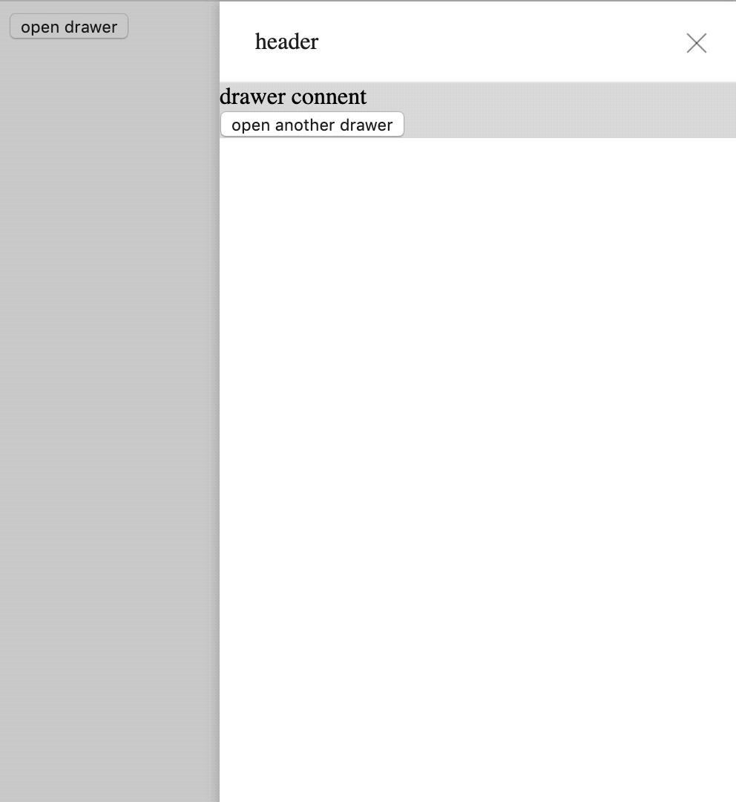

# Vue-Drawer-Plugin

[](https://codecov.io/gh/noxxxxxxxx/vue-drawer-plugin)
[](https://img.shields.io/badge/VueJs-2.x-green.svg) [](https://img.shields.io/github/license/noxxxxxxxx/drawer.svg?color=green&label=LICENSE)
[](https://travis-ci.com/noxxxxxxxx/vue-drawer-plugin)
[](http://makeapullrequest.com)

A panel which slides in from the edge of the screen.

## When To Use

A Drawer is a panel that is typically overlaid on top of a page and slides in from the side. It contains a set of information or actions. Since the user can interact with the Drawer without leaving the current page, tasks can be achieved more efficiently within the same context.

- Use a Form to create or edit a set of information.

- Processing subtasks. When subtasks are too heavy for a Popover and we still want to keep the subtasks in the context of the main task, Drawer comes very handy.

- When the same Form is needed in multiple places.

## API

Props | Description |  Type  | Default
-|-|-|-
showClose | Whether a close (x) button is visible on top right of the Drawer dialog or not. | `Boolean` | true |
showHeader |  Whether a header container is visible on top of the Drawer dialog or not, which you can set the title. | `Boolean` | true |
title |  You can set the title if showHeader is true. | `String` | - |
mask | Whether to show mask or not. | `Boolean` | true |
maskCloseable | Clicking on the mask (area outside the Drawer) to close the Drawer or not. | `Boolean` | true |
maskStyle | Style of Drawer's mask element. | `Object` | - |
wrapStyle | Style of Drawer wrapper. | `Object` | - |
bodyStyle | Style of floating layer, typically used for adjusting its position. | `Object` | - |
visible | Whether the Drawer dialog is visible or not. | `Boolean` | false |
width | Width of the Drawer dialog. | `String ｜ Number` | 256 |
height | Placement is top or bottom, height of the Drawer dialog. | `String ｜ Number` | 256 |
className | The class name of the container of the Drawer dialog. | `String` | - |
zIndex | The z-index of the Drawer. | `Number` | 1000 |
placement | The placement of the Drawer. | `String` | 'right' |
close-on-press-escape | Whether the  dialog can be closed by pressing ESC. | `boolean` | true |
before-close | Callback before Drawer Dialog close, and it will prevent Dialog from closing. | function(done)，done is used to close the Drawer Dialog | - |

## How to use

### Install

```js
npm install vue-drawer-plugin -S

// or

yarn add vue-drawer-plugin
```
### Demo



### Quick Start

```js
import vueDrawer from 'vue-drawer-plugin';

Vue.use(vueDrawer);
```

```js
// single-component.vue
<template>
    <vue-drawer
        :visible.sync="visible"
        class="test-wrap-class"
        title="header"
        width="70vw"
        height="200px"
        @opened="opened"
        :before-close="handleClose"
        @close="closeRightNow"
        @closed="closed"
        :wrap-style="{ border: '1px solid #ddd' }"
        :body-style="{ background: '#ddd' }"
        :mask-closeable="true"
        :show-close="true"
    >
    <div>This is content inside Drawer dialog</div>
    <button @click="openAnother">feel free to open another Drawer inside your Drawer</button>
</vue-drawer>
</template>
```

## Browser Support

Modern browsers and Internet Explorer 10+.

| [](http://godban.github.io/browsers-support-badges/)</br>IE / Edge | [](http://godban.github.io/browsers-support-badges/)</br>Firefox | [](http://godban.github.io/browsers-support-badges/)</br>Chrome | [](http://godban.github.io/browsers-support-badges/)</br>Safari | [](http://godban.github.io/browsers-support-badges/)</br>Opera | [](http://godban.github.io/browsers-support-badges/)</br>Electron |
| --- | --- | --- | --- | --- | --- |
| IE10, IE11, Edge | last 2 versions | last 2 versions | last 2 versions | last 2 versions | last 2 versions |

## Development

Skip this part if you just want to use vue-drawer-plugin.

For those who are interested in contributing to this plugin, you can submit pull request or just download this repository and run.

## License

vue-drawer-plugin is released under the [MIT License](http://www.opensource.org/licenses/MIT).
